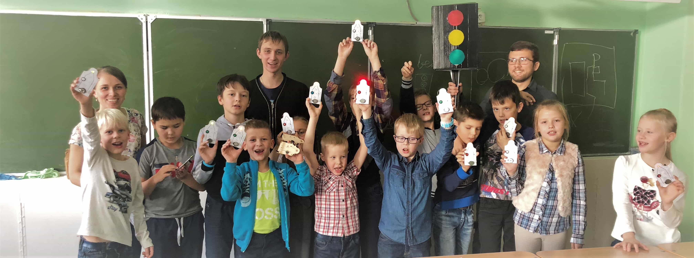

# The SamoSvet project

The SamoSvet is an educational project for kids.
It has designed with finance supporting an initiative [Meet-and-Code](https://meet-and-code.org/).
I organized this project as master class for demonstrate children possibility of the programming and captivate them to wonderful world of electronics and Arduino.

It is includes:
* [electronics](electronics/) - schemes of the personal small model and big model of the traffic light;
* [nodemcu](nodemcu/) - code of the NodeMCU controller that is a heart of the big one;
* [mobile](https://github.com/GRomR1/qt-samosvet-mobile-app) - a mobile app to remote control a big model.
