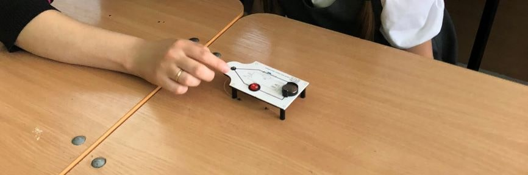
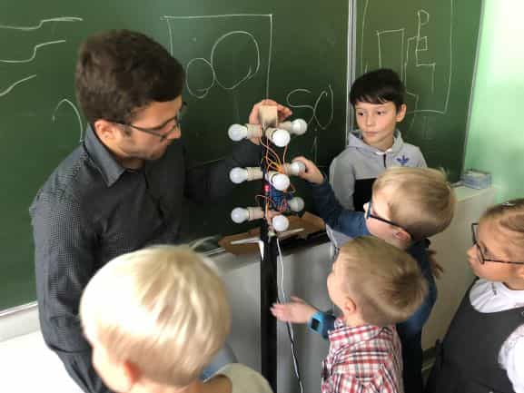

# Build scheme and electronics

There is a sources to build two traffic lights:

* [a small](small-schemes/) - is example of the simple electro-circuit; when to place nearby, three pieces of the model allows build small traffic light;

* [a big](big-schemes/) - is a model of the big traffic light that controls remote over WiFi from a smartphone app.
